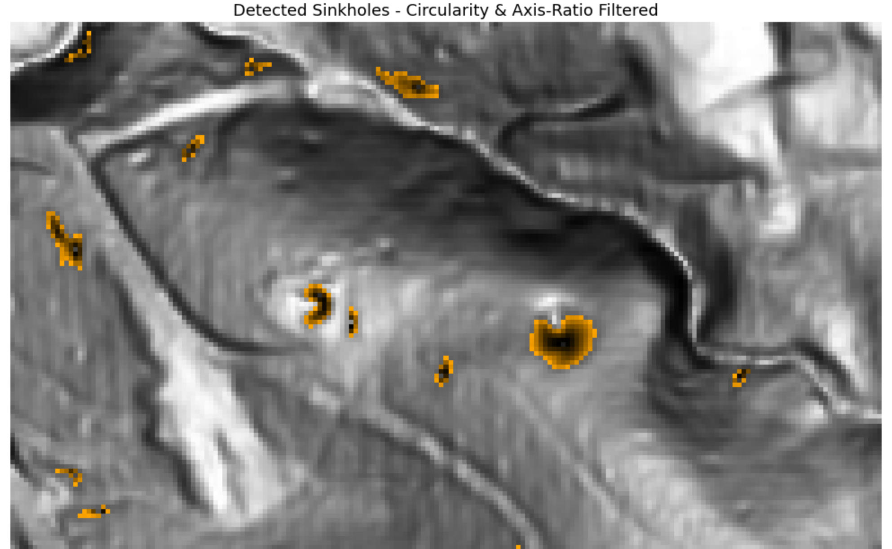

# LiDAR Sinkhole Detection Tool

A Python-based tool for automated sinkhole detection from LiDAR-derived Digital Elevation Models (DEMs). Identifies surface depressions characteristic of sinkhole activity using depression filling, circularity filtering, and axis-ratio analysis.

Built as part of an applied AI and Python toolkit for civil and geotechnical engineering workflows.

---

## What It Does

The tool ingests a single-band GeoTIFF elevation raster and:

1. Optionally smooths the DEM to reduce LiDAR noise
2. Fills surface depressions using the RichDEM library
3. Computes depression depth across the raster
4. Filters candidate regions by size, circularity, and axis ratio to isolate true sinkhole-like features
5. Outputs a color-coded raster, a GeoJSON vector file, and a CSV report

---

## Example Output



*Yellow-orange pixels indicate shallow depression edges; black pixels indicate deep depression centers. Grayscale background is the original DEM.*

---

## Installation

**Clone the repository:**
```bash
git clone https://github.com/YOUR-USERNAME/sinkhole-detection.git
cd sinkhole-detection
```

**Install dependencies:**
```bash
pip install -r requirements.txt
```

> Note: `richdem` may require additional system dependencies on some platforms.
> See [RichDEM installation docs](https://richdem.readthedocs.io) if you encounter issues.

---

## Usage

### Jupyter Notebook

Edit the `JUPYTER_CONFIG` block at the top of `sinkhole_detect.py`:

```python
JUPYTER_CONFIG = {
    'input_file':         'your_dem.tif',   # Path to your DEM GeoTIFF
    'output_dir':         'results/',
    'min_sinkhole_depth': 15,
    'max_sinkhole_depth': 100,
    'min_area':           10,
    'min_circularity':    0.4,
    'max_axis_ratio':     4.5,
    'gaussian_sigma':     0.7,
}
```

Then run the script as a cell:
```python
%run sinkhole_detect.py
```

### Command Line

```bash
python sinkhole_detect.py --input your_dem.tif --output results/
```

**All available options:**
```
--input       Path to input DEM GeoTIFF (required)
--output      Output directory (default: results/)
--min-depth   Minimum depression depth in DEM units (default: 15)
--max-depth   Maximum depression depth in DEM units (default: 100.0)
--min-area    Minimum region area in pixels (default: 10)
--min-circ    Minimum circularity 0-1, where 1 = perfect circle (default: 0.4)
--max-axis    Maximum axis ratio, filters linear features like ditches (default: 4.5)
--sigma       Gaussian smoothing sigma, 0 = disabled (default: 0.7)
```

**Example with custom parameters:**
```bash
python sinkhole_detect.py --input site_dem.tif --output results/ --min-depth 0.3 --sigma 1.5
```

---

## Input Requirements

| Property | Requirement |
|----------|-------------|
| Format | GeoTIFF (.tif) |
| Bands | Single band (elevation values) |
| Data type | Float or integer |
| Georeferencing | Required (embedded CRS) |
| Units | Meters or feet (consistent throughout) |

The input must be a **Digital Elevation Model** — each pixel value represents ground elevation, not color. Raw imagery will not work.

**Free sources for LiDAR DEMs:**
- [USGS 3DEP National Map](https://apps.nationalmap.gov/downloader/) — full US coverage
- [OpenTopography](https://opentopography.org) — high-resolution research datasets
- State GIS portals — often higher resolution than federal sources
- QGIS is an excellent tool and it is open sourced

---

## Outputs

All outputs are written to the specified output directory:

| File | Description |
|------|-------------|
| `*_sinkholes.tif` | 3-band RGB GeoTIFF with color-coded sinkhole overlay |
| `*_sinkholes.geojson` | Vector point file with sinkhole centroids and attributes |
| `*_sinkholes.csv` | Tabular report of all detected sinkholes |
| `*_preview.png` | Visualization image with color legend |

**CSV / GeoJSON attributes per sinkhole:**

| Field | Description |
|-------|-------------|
| `id` | Sinkhole index |
| `area_px` | Region area in pixels |
| `max_depth` | Maximum depression depth |
| `mean_depth` | Mean depression depth |
| `circularity` | Shape circularity (0–1) |
| `axis_ratio` | Major/minor axis ratio |
| `centroid_x` | Real-world X coordinate (CRS units) |
| `centroid_y` | Real-world Y coordinate (CRS units) |

---

## Detection Parameters Explained

| Parameter | What It Controls | Raise to... | Lower to... |
|-----------|-----------------|-------------|-------------|
| `min_sinkhole_depth` | Minimum depression to flag | Reduce false positives | Catch shallower features |
| `max_sinkhole_depth` | Maximum depression to flag | Allow deeper features | Filter deep artifacts |
| `min_area` | Smallest flagged region | Ignore small noise | Catch smaller sinkholes |
| `min_circularity` | How round a feature must be | Stricter shape filter | Allow irregular shapes |
| `max_axis_ratio` | How elongated a feature can be | Reject more linear features | Allow more elongated shapes |
| `gaussian_sigma` | Pre-smoothing strength | Reduce noise sensitivity | Preserve fine detail |

---

## Dependencies

| Package | Purpose |
|---------|---------|
| `richdem` | Depression filling algorithm |
| `rasterio` | GeoTIFF read/write |
| `numpy` | Array operations |
| `scipy` | Gaussian smoothing, region labeling |
| `scikit-image` | Region property measurement |
| `matplotlib` | Visualization |
| `geopandas` | GeoJSON vector output |
| `shapely` | Geometry objects |

---

## Project Context

This tool was developed to demonstrate applied Python and AI-assisted engineering workflows as part of a professional civil engineering portfolio. It addresses a real geotechnical problem — automated karst feature detection from airborne LiDAR surveys — using open-source geospatial tools.

Potential applications include:
- Preliminary site investigation screening
- Infrastructure corridor risk assessment
- Regional karst mapping support

---

## License

MIT License — free to use, modify, and distribute with attribution.

---

## Author

**Nicholas Geren**
Civil Engineering Student | Python & GIS Enthusiast
[LinkedIn](https://www.linkedin.com/in/nicholas-geren-9b6135397/) | [GitHub](https://github.com/NicholasGeren)
